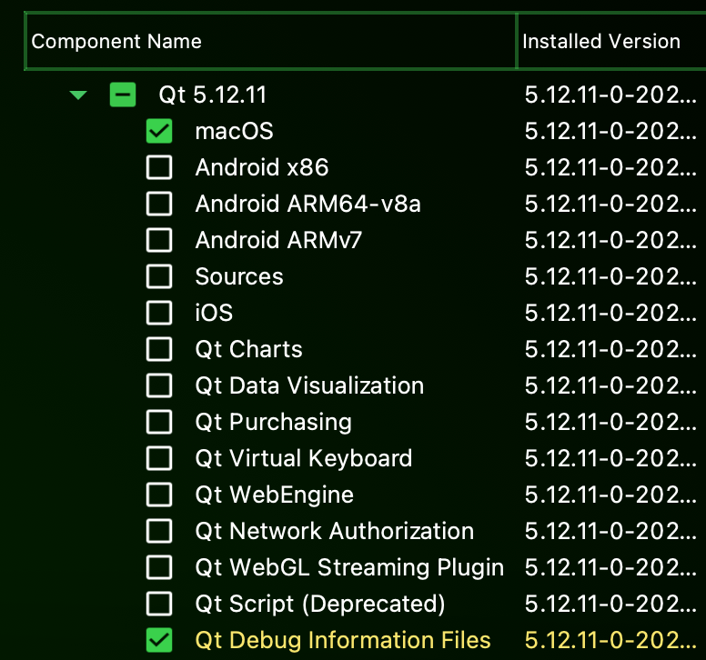
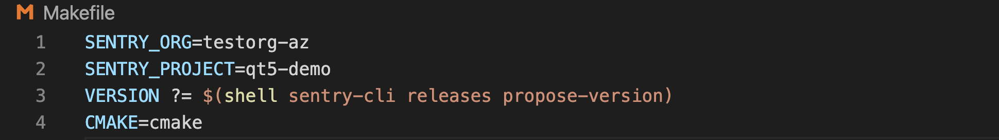
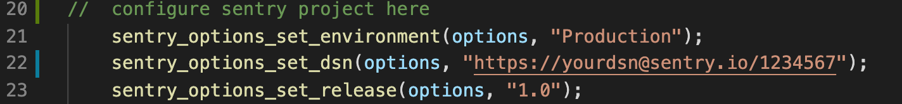

## Overviews

This project is a demo implementation of **sentry-native** in a QT application, the Sentry SDK for Native Crash Reporting. The demo produces a native crash that gets captured by sentry-native and sent to Sentry.io This demo uses sentry-native in its packaged release form - it is referenced as a submodule. You can also download it separately here https://github.com/getsentry/sentry-native as a distribution zip.

The **Official Sentry Documentation** for Qt is at https://docs.sentry.io/platforms/native/guides/qt

## Setup
| dependency    |    version     |
| ------------- | :------------: |
| sentry-native |     0.4.11     |
| sentry-cli    |     1.4.9      |
| Qt            |     5.12.11    |
| Xcode         |     12.5.1     |
| cmake         |     3.20.5     |
| macOS         |  Big Sur 11.4  |

<ins>cmake</ins>

- `brew install cmake`

<ins>sentry-cli</ins>

- `yarn global add @sentry/cli`. You can also get it from https://github.com/getsentry/sentry-cli/releases/ or https://docs.sentry.io/cli/installation/

<ins>Qt</ins>

follow this link https://www.qt.io/download to install **Qt Installer** and continue setting up Qt.

**Note**: for this demo these 2 components should suffice 



<ins>Xcode</ins>

Qt depends on Xcode, follow this link to download Xcode https://developer.apple.com/xcode/

## Configuration 
### Enviroment Variables
```cmake
CMAKE_PREFIX_PATH="/path/to/Qt/5.12.11/clang_64/lib/cmake/Qt5"
sentry_DIR="/path/to/Qt-demo/sentry-native/install"
```
**Note**: the install path a.k.a sentry_DIR would be created upon running the bash script

### Makefile adjustment
Inside *Qt-demo/Makefile* modify the first 2 lines to your Sentry **Organization Slug** and **Project Name** respectivley. Both can be found in [Sentry.io](www.sentry.io) under Settings.


### DSN key

Inside *Qt-demo/main.cpp* modify `sentry_options_set_dsn()` to your project's DSN key. You can also set **enviroment** and **release** if need be.<br>


### Enable Suspect Commits

In sentry.io under *Settings -> Integrations -> Github* 
Install Github integrations and add your repository. More can be found on our [Github Documentation](https://docs.sentry.io/product/integrations/source-code-mgmt/github/)
## Run
1. `git clone --recurse-submodules https://github.com/dachakra/QT-demo.git`
2. Makefile adjustment
3. Add enviroment variables 
4. `bash run.sh`


## Technical Notes  
### What's Happening:
 
`make` or `make all` has several targets:
- Building sentry-native sdk with options `SENTRY_INTEGRATION_QT=YES` and `SENTRY_BACKEND=CRASHPAD` more can be found in [Compile-time options](https://github.com/getsentry/sentry-native/tree/290fa46ec868b5f23f720fff253c1da8746ce249#compile-time-options)
- Generating Sentry dynamic library and crashpad handler 
- Generating the builds directory for the Qt application 

`make setup_release` creates a Sentry Release and associates git commits

`make upload_debug_files` uploads your symbols to Project Settings > Debug Files https://sentry.io/settings/${YOUR_ORG}/projects/${PROJECT}/debug-symbols/. You can also access your symbols from a Symbol Server https://docs.sentry.io/workflow/debug-files/#symbol-servers

**`run.sh` actions:**
1. creates bin directory
2. `make all`
3. `make` on build directory for Qt app
4. copies exec generated to bin 
5. `make setup_release`
6. `make upload_debug_files` found in bin directory

### Upgrade Pathway

This demo app was tested with sentry-native v0.4.11

```
git pull // gets latest code
git submodule update --init --recursive // updates the 'sentry-native' submodule
make bin/example // or make all. start building again, with the newer Release of sentry-native
```

## Troubleshooting

adding debug symbols for Qt to symbolicate Qt functions

If the standalone distribution package doesn't fit your needs, then go to https://github.com/getsentry/sentry-native#development

sentry-native in the news https://blog.sentry.io/2019/09/26/fixing-native-apps-with-sentry

## Gif


